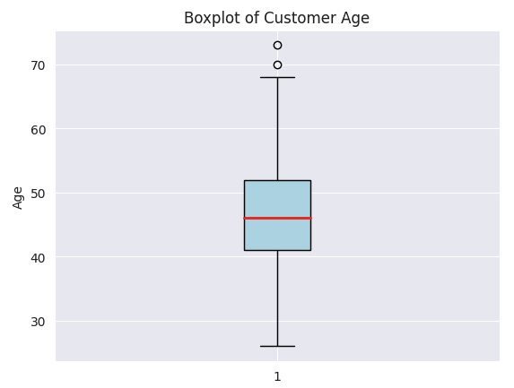
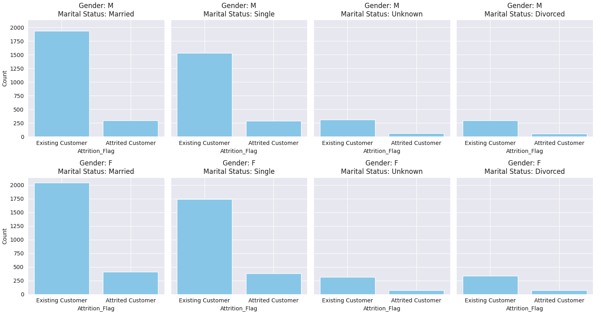
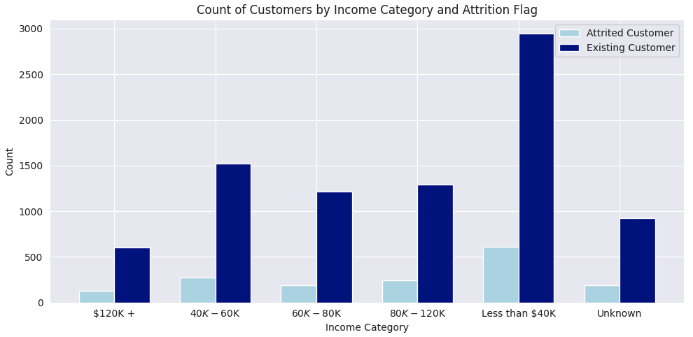
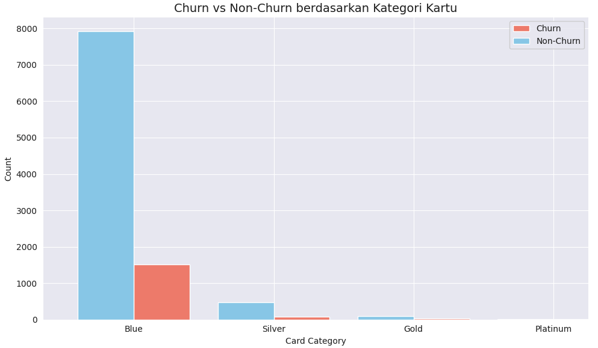
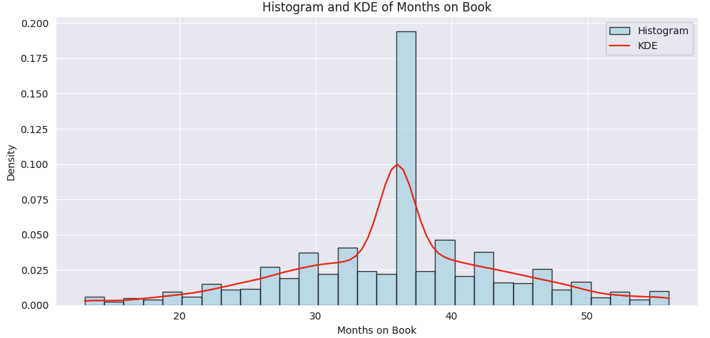
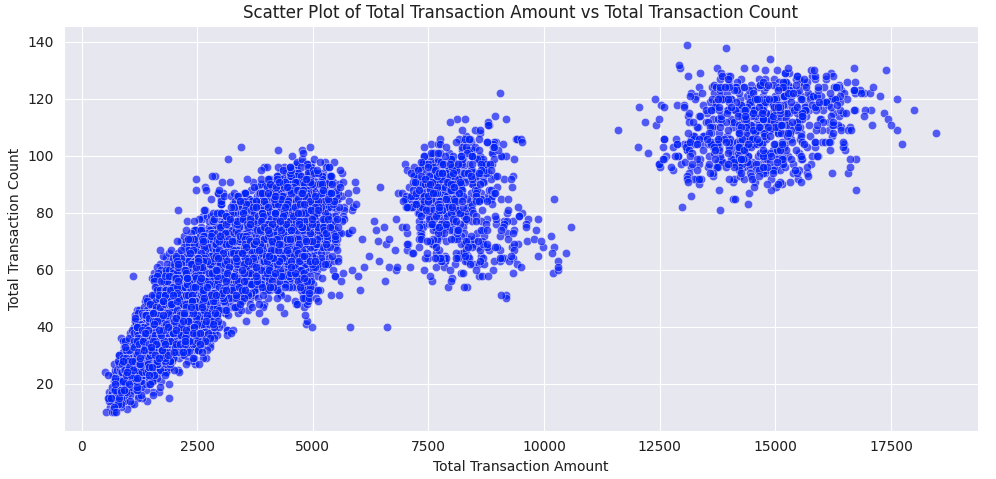
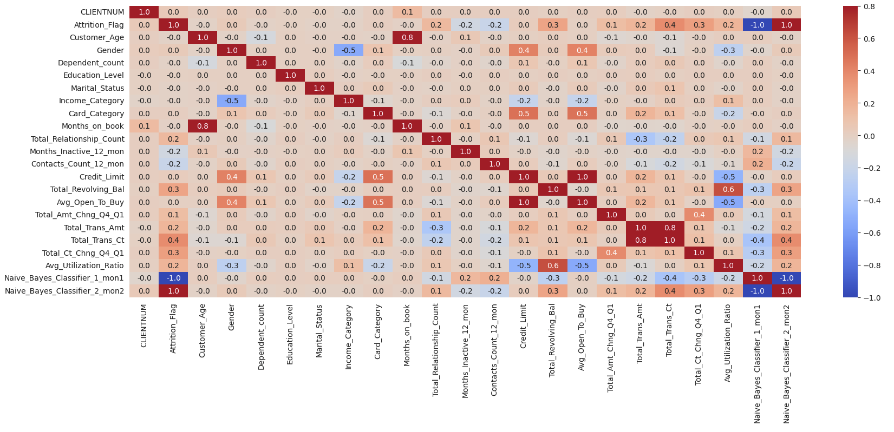

# Laporan Proyek Machine Learning - Muhammad Iqbal Pradipta

## Banking Customer Churn Prediction

 Attrisi nasabah di industri perbankan terjadi ketika konsumen berhenti menggunakan produk dan layanan yang ditawarkan oleh bank untuk beberapa waktu, dan kemudian mengakhiri hubungan mereka dengan bank. Oleh karena itu, retensi nasabah menjadi sangat penting dalam pasar perbankan yang sangat kompetitif saat ini [1]. Selain itu, memiliki basis pelanggan yang kuat membantu menarik konsumen baru dengan membangun kepercayaan dan mendapatkan referensi dari pelanggan yang sudah ada. Faktor-faktor ini menjadikan pengurangan attrisi nasabah sebagai langkah penting yang harus ditempuh oleh bank [2].

Dalam projek ini, bertujuan untuk menganalisis data bank dan memprediksi pengguna mana yang kemungkinan besar akan berhenti menggunakan layanan bank dan beralih menjadi nasabah yang membayar. Menganalisis data ini akan membantu bank mengidentifikasi tren dan berusaha mempertahankan nasabah yang berada di ambang attrisi.
  

## Business Understanding

Proyek ini berfokus pada masalah attrisi nasabah (churn) di industri perbankan. Attrisi terjadi ketika pelanggan berhenti menggunakan produk dan layanan perbankan, yang berdampak negatif pada pendapatan bank. Dalam industri yang sangat kompetitif, retensi pelanggan menjadi penting untuk menjaga stabilitas bisnis dan mengurangi biaya akuisisi nasabah baru. Dengan memiliki data historis dari pelanggan, kita dapat menggunakan machine learning untuk memprediksi nasabah yang berisiko berhenti.

Bagian laporan ini mencakup:

### Problem Statements

Berdasarkan latar belakang di atas, berikut ini batasan masalah yang dapat diselesaikan dengan proyek ini:

- Bagaimana cara melakukan pra-pemrosesan data agar dapat digunakan untuk melatih model?.
- Bagaiman cara membuat arsitektur model yang akan digunakan untuk memprediksi?.

### Goals

- Melakukan pre-pemrosesan data dengan baik agar dapat digunakan.
- Mengetahui cara membuat model deep learning untuk memprediksi atau mengidentifikasi pelanggan yang beresiko churn.
- Fitur apa yang paling berpengaruh di dalam pelanggan yang churn atau tidak.

Pengembangan model prediksi akan dilakukan dengan menggunakan beberapa algoritma machine learning, yaitu Logistic Regression dan Random Forest. Logistic Regression dipilih karena sifatnya yang mudah diinterpretasikan dan sering digunakan untuk kasus klasifikasi biner. Random Forest dipilih karena kemampuannya menangani data yang kompleks dan bekerja dengan baik pada dataset yang memiliki banyak fitur.

Dengan kedua model ini, akan dipilih satu model yang memiliki performa terbaik berdasarkan beberapa metrik evaluasi, seperti akurasi, precision, recall, dan F1-score. Model terbaik akan dipilih berdasarkan keseimbangan performa pada metrik tersebut.

### Solution statements
Solusi yang dapat dilakukan sebagai berikut:

- Membuat model deep learning.
- Menggunakan Classifictaion Report untuk mengevaluasi model saat testing dan accuracy saat train.
- Membuat graphic heatmap untuk membantu fitur apa yang berpengaruh.

## Data Understanding
Dataset yang digunakan dapat diakses menggunakan [Huggingface Dataset](https://huggingface.co/datasets/mhdiqbalpradipta/credit_card_customer).

### Langkah-langkah pra-pemrosesan data
1. Menguhubungkan google drive ke google colab.
2. Membaca dataset menggunakan pandas
3. Menampilkan informasi dari dataset
4. Mengecek apakah terdapat missing value

**1. Menghubungkan google drive ke google colab**

Pada proyek dataset yang sudah di download melalui huggingface, maka dataset akan disimpan ke dalam google drive. Dari google colab akan diakses dengan cara

```python
from google.colab import drive
drive.mount('/content/drive')
```

setelah di mount maka akan menentukan file path google drive yang akan diakses google colab

```python
base_path = '/content/drive/My Drive/ColabNotebooks/dicoding_ai/machine_learning_terapan/customer_cc.csv'
```

**2. Membaca dataset menggunakan pandas**

Pada momen ini akan menggunakan fungsi read_csv() untuk membaca berkas dan menyesuaikan ke pandas Dataframe

```python
credit_card = pd.read_csv(base_path)
credit_card
```
Berikut tampilan credit_card dengan bentuk Dataframe di tabel 1.

Tabel 1. Tampilan sample credit_card dalam bentuk pandas Dataframe

| CLIENTNUM  | Attrition_Flag    | Customer_Age | Gender | Dependent_count | Education_Level | Marital_Status | Income_Category   | Card_Category | Months_on_book | Credit_Limit | Total_Revolving_Bal | Avg_Open_To_Buy | Total_Amt_Chng_Q4_Q1 | Total_Trans_Amt | Total_Trans_Ct | Total_Ct_Chng_Q4_Q1 | Avg_Utilization_Ratio | Naive_Bayes_Classifier_1_mon1 | Naive_Bayes_Classifier_2_mon2 |
|------------|-------------------|--------------|--------|-----------------|-----------------|----------------|-------------------|---------------|----------------|--------------|---------------------|-----------------|-----------------------|----------------|----------------|----------------------|----------------------|-------------------------------|-------------------------------|
| 768805383  | Existing Customer  | 45           | M      | 3               | High School     | Married        | $60K - $80K       | Blue          | 39             | 12691.0      | 777                 | 11914.0         | 1.335                 | 1144           | 42             | 1.625                | 0.061                | 0.000093                      | 0.999910                      |
| 818770008  | Existing Customer  | 49           | F      | 5               | Graduate        | Single         | Less than $40K    | Blue          | 44             | 8256.0       | 864                 | 7392.0          | 1.541                 | 1291           | 33             | 3.714                | 0.105                | 0.000057                      | 0.999940                      |

**3. Menampilkan informasi dari dataset**

Dengan menggunakan .shape pada credit_card maka di dapat informasi seperti berikut

```python
rows, cols = credit_card.shape
print(f"Jumlah baris: {rows}")
print(f"Jumlah kolom: {cols}")
```

Jumlah baris: 10127 dan jumlah kolom: 23

kemudian cek untuk mengetahui info dari dataset dengan credit_card.info() di tabel 2:

Tabel 2: informasi dari dataset credit_card

|   Column                         | Non-Null Count  | Dtype   |
|----------------------------------|------------------|---------|
| 0 CLIENTNUM                      | 10127 non-null   | int64   |
| 1 Attrition_Flag                 | 10127 non-null   | object  |
| 2 Customer_Age                   | 10127 non-null   | int64   |
| 3 Gender                         | 10127 non-null   | object  |
| 4 Dependent_count                | 10127 non-null   | int64   |
| 5 Education_Level                | 10127 non-null   | object  |
| 6 Marital_Status                 | 10127 non-null   | object  |
| 7 Income_Category                | 10127 non-null   | object  |
| 8 Card_Category                  | 10127 non-null   | object  |
| 9 Months_on_book                 | 10127 non-null   | int64   |
| 10 Total_Relationship_Count      | 10127 non-null   | int64   |
| 11 Months_Inactive_12_mon        | 10127 non-null   | int64   |
| 12 Contacts_Count_12_mon         | 10127 non-null   | int64   |
| 13 Credit_Limit                  | 10127 non-null   | float64 |
| 14 Total_Revolving_Bal           | 10127 non-null   | int64   |
| 15 Avg_Open_To_Buy               | 10127 non-null   | float64 |
| 16 Total_Amt_Chng_Q4_Q1         | 10127 non-null   | float64 |
| 17 Total_Trans_Amt               | 10127 non-null   | int64   |
| 18 Total_Trans_Ct                | 10127 non-null   | int64   |
| 19 Total_Ct_Chng_Q4_Q1           | 10127 non-null   | float64 |
| 20 Avg_Utilization_Ratio         | 10127 non-null   | float64 |
| 21 Naive_Bayes_Classifier_1_mon1 | 10127 non-null   | float64 |
| 22 Naive_Bayes_Classifier_2_mon2 | 10127 non-null   | float64 |


**4. Mengecek apakah terdapat missing value**

Pada bagian ini digunakan fungsi isnull().sum() untuk tiap DataFrame. Saat dicek tidak ditemukan adanya missing value pada dataset bisa dilihat dari tabel 2.


## Ringkasan Statistik Dataset

Dalam konteks proyek prediksi churn pelanggan di industri perbankan, tahapan ini sangat penting untuk mengidentifikasi pola, tren, dan hubungan antar variabel yang dapat memengaruhi churn.
```python
# Menampilkan ringkasan statistik dari dataset
credit_card.describe()
```

Berikut adalah ringkasan statistik dari dataset yang digunakan dalam analisis:

Tabel 3 : Melakukan describe data 

| Statistika                       | CLIENTNUM       | Customer_Age | Dependent_count | Months_on_book | Total_Relationship_Count | Months_Inactive_12_mon | Contacts_Count_12_mon | Credit_Limit | Total_Revolving_Bal | Avg_Open_To_Buy | Total_Amt_Chng_Q4_Q1 | Total_Trans_Amt | Total_Trans_Ct | Total_Ct_Chng_Q4_Q1 | Avg_Utilization_Ratio | Naive_Bayes_Classifier_1_mon1 | Naive_Bayes_Classifier_2_mon2 |
|----------------------------------|------------------|--------------|------------------|-----------------|-------------------------|-------------------------|-----------------------|--------------|--------------------|------------------|---------------------|------------------|----------------|---------------------|-------------------------|-------------------------------|-------------------------------|
| **count**                        | 1.012700e+04     | 10127.000000 | 10127.000000     | 10127.000000    | 10127.000000            | 10127.000000            | 10127.000000          | 10127.000000 | 10127.000000       | 10127.000000     | 10127.000000        | 10127.000000     | 10127.000000   | 10127.000000        | 10127.000000            | 10127.000000                  | 10127.000000                  |
| **mean**                        | 7.391776e+08     | 46.325960    | 2.346203         | 35.928409       | 3.812580                | 2.341167                | 2.455317              | 8631.953698  | 1162.814061        | 7469.139637      | 0.759941            | 4404.086304      | 64.858695      | 0.712222            | 0.274894                | 0.159997                     | 0.840003                     |
| **std**                         | 3.690378e+07     | 8.016814     | 1.298908         | 7.986416        | 1.554408                | 1.010622                | 1.106225              | 9088.776650  | 814.987335         | 9090.685324      | 0.219207            | 3397.129254      | 23.472570      | 0.238086            | 0.275691                | 0.365301                     | 0.365301                     |
| **min**                         | 7.080821e+08     | 26.000000    | 0.000000         | 13.000000       | 1.000000                | 0.000000                | 0.000000              | 1438.300000  | 0.000000           | 3.000000         | 0.000000            | 510.000000       | 10.000000      | 0.000000            | 0.000000                | 0.000008                     | 0.000420                     |
| **25%**                         | 7.130368e+08     | 41.000000    | 1.000000         | 31.000000       | 3.000000                | 2.000000                | 2.000000              | 2555.000000  | 359.000000         | 1324.500000      | 0.631000            | 2155.500000      | 45.000000      | 0.582000            | 0.023000                | 0.000099                     | 0.999660                     |
| **50%**                         | 7.179264e+08     | 46.000000    | 2.000000         | 36.000000       | 4.000000                | 2.000000                | 2.000000              | 4549.000000  | 1276.000000        | 3474.000000      | 0.736000            | 3899.000000      | 67.000000      | 0.702000            | 0.176000                | 0.000181                     | 0.999820                     |
| **75%**                         | 7.731435e+08     | 52.000000    | 3.000000         | 40.000000       | 5.000000                | 3.000000                | 3.000000              | 11067.500000 | 1784.000000        | 9859.000000      | 0.859000            | 4741.000000      | 81.000000      | 0.818000            | 0.503000                | 0.000337                     | 0.999900                     |
| **max**                         | 8.283431e+08     | 73.000000    | 5.000000         | 56.000000       | 6.000000                | 6.000000                | 6.000000              | 34516.000000 | 2517.000000        | 34516.000000     | 3.397000            | 18484.000000     | 139.000000     | 3.714000            | 0.999000                | 0.999580                     | 0.999990                     |


Pada tabel 2 disini akan dijelaskan mengenai variabel.

### Berikut penjelasan variabel-variabel pada credit card dataset adalah sebagai berikut:
- CLIENTNUM: Pengidentifikasi unik untuk setiap pelanggan (Integer).
- Attrition_Flag: Menunjukkan apakah pelanggan telah berhenti atau tidak (Boolean).
- Customer_Age: Usia pelanggan (Integer).
- Gender: Jenis kelamin pelanggan (String).
- Dependent_count: Jumlah tanggungan yang dimiliki pelanggan (Integer).
- Education_Level: Tingkat pendidikan pelanggan (String).
- Marital_Status: Status pernikahan pelanggan (String).
- Income_Category: Kategori pendapatan pelanggan (String).
- Card_Category: Jenis kartu yang dimiliki oleh pelanggan (String).
- Months_on_book: Lama waktu (dalam bulan) pelanggan telah terdaftar (Integer).
- Total_Relationship_Count: Jumlah total hubungan yang dimiliki pelanggan dengan penyedia kartu kredit (Integer).
- Months_Inactive_12_mon: Jumlah bulan pelanggan tidak aktif dalam 12 bulan terakhir (Integer).
- Contacts_Count_12_mon: Jumlah kontak yang dilakukan pelanggan dengan penyedia dalam 12 bulan terakhir (Integer).
- Credit_Limit: Batas kredit pelanggan (Integer).
- Total_Revolving_Bal: Total saldo bergulir (utang kartu kredit yang ditanggung bulan ke bulan) pelanggan (Integer).
- Avg_Open_To_Buy: Rata-rata kredit yang tersedia (kredit yang belum digunakan) untuk pelanggan (Integer).
- Total_Amt_Chng_Q4_Q1: Total perubahan jumlah pengeluaran dari Kuartal 4 ke Kuartal 1 (Integer).
- Total_Trans_Amt: Total jumlah transaksi selama periode tertentu (Integer).
- Total_Trans_Ct: Jumlah total transaksi selama periode tertentu (Integer).
- Total_Ct_Chng_Q4_Q1: Perubahan jumlah total transaksi dari Kuartal 4 ke Kuartal 1 (Integer).
- Avg_Utilization_Ratio: Rata-rata rasio pemanfaatan kredit pelanggan (Integer).
- Naive_Bayes_Classifier_1_mon1: Klasifikasi Naive Bayes untuk memprediksi apakah pelanggan akan berhenti berdasarkan faktor seperti kategori kartu, jumlah kontak dalam 12 bulan terakhir, jumlah tanggungan, tingkat pendidikan, dan jumlah bulan tidak aktif dalam 12 bulan terakhir.
- Naive_Bayes_Classifier_1_mon2


**Tahapan Memahami data / EDA**

**Boxplot**

Dari boxplot ini menunjukkan bahwa mayoritas pelanggan berada dalam rentang usia 40-52 tahun, dengan beberapa outliers yang usianya di atas 70 tahun terdapat pada gambar 1:



Gambar 1: Boxplot dataset credit_card

**Menampilkan kolom mana yang bersifat kategorikal**

Kode ini berfungsi untuk mengidentifikasi kolom mana saja yang bersifat kategorikal dalam dataset credit_card, yang sering kali diperlukan untuk tahap pre-processing seperti encoding (misalnya dengan Label Encoding) sebelum digunakan dalam model machine learning.

```python
categorical_features = credit_card.select_dtypes(include=['object']).columns.tolist()

# Menampilkan array yang berisi nama-nama kolom bertipe object
print(categorical_features)
```
**Interpretasi Bisnis dari graphic dibawah:**

**1. Pelanggan Existing vs Attrited Berdasarkan Gender dan Status Pernikahan:**

* Baik pada pria maupun wanita, pelanggan yang sudah menikah tampaknya memiliki tingkat churn (attrited) yang lebih rendah dibandingkan dengan pelanggan yang masih single atau tidak diketahui status pernikahannya.
* Pada kategori pelanggan "Married" (baik pria maupun wanita), terdapat jumlah pelanggan existing yang sangat tinggi dibandingkan dengan pelanggan yang attrited.
* Pelanggan dengan status "Single" juga menunjukkan pola serupa, meskipun dengan jumlah yang sedikit lebih rendah.

**2. Peran Status Pernikahan dalam Pelanggan Attrited:**

* Pelanggan dengan status pernikahan "Unknown" dan "Divorced" cenderung memiliki tingkat churn yang lebih tinggi atau hampir sama dengan existing customer dalam kategori tertentu.
* Ini bisa menunjukkan bahwa status pernikahan mempengaruhi stabilitas hubungan pelanggan dengan perusahaan, di mana pelanggan yang menikah cenderung lebih setia.

**3. Peluang Segmentasi Pelanggan:**

* Pelanggan yang sudah menikah tampaknya lebih loyal dibandingkan dengan kategori lainnya. Hal ini bisa digunakan oleh perusahaan untuk menawarkan produk yang lebih relevan bagi segmen ini.



Gambar 2: Hubungan antara Attrition_Flag dengan status pernikahan

**Interpretasi Bisnis:**

**1. Distribusi Pelanggan Existing:**

* Pelanggan dengan pendapatan kurang dari 40K memiliki jumlah paling tinggi dalam kategori existing customer, jauh melebihi kategori pendapatan lainnya. Hal ini menunjukkan bahwa perusahaan memiliki basis pelanggan yang kuat di segmen berpenghasilan rendah.
Kategori pendapatan 40K s/d 60K juga memiliki jumlah pelanggan existing yang cukup besar, meskipun lebih sedikit dibandingkan kategori berpenghasilan rendah.
* Pelanggan existing di kategori pendapatan 120K+ dan 80K s/d 120K relatif sedikit, menandakan bahwa perusahaan tidak banyak menarik pelanggan di segmen pendapatan tinggi.

**2. Distribusi Pelanggan Attrited (Churned):**

* Pelanggan attrited juga cenderung lebih banyak di kategori pendapatan kurang dari 40K dan Unknown, tetapi dalam jumlah yang lebih kecil dibandingkan existing customer.
* Kategori pendapatan yang lebih tinggi, seperti 120K+ dan 80K s/d 120K, memiliki jumlah churn yang sangat rendah. Ini mungkin menunjukkan bahwa pelanggan berpenghasilan tinggi cenderung lebih stabil atau perusahaan lebih jarang menjangkau segmen ini.

**3. Peluang dan Tantangan:**

* Peluang di Segmen Berpenghasilan Rendah: Basis pelanggan terbesar perusahaan berada di segmen berpenghasilan rendah. Perusahaan dapat terus fokus di segmen ini dengan produk yang terjangkau dan program loyalitas yang kuat.
* Tantangan di Segmen Berpenghasilan Tinggi: Perusahaan memiliki basis pelanggan yang sangat kecil di segmen pendapatan tinggi, baik untuk existing maupun attrited customer. Ada peluang untuk memperluas penetrasi di pasar ini dengan penawaran produk yang lebih premium dan layanan yang disesuaikan.
* Kategori "Unknown": Sejumlah pelanggan di kategori "Unknown" menandakan kurangnya informasi pendapatan pelanggan. Mengidentifikasi pendapatan ini dapat memberikan insight yang lebih baik untuk strategi retensi dan akuisisi pelanggan.



Gambar 3: Gambar income_category_with_attrition

- Kemudian kita juga bisa lihat di kategori kartu dimana pengguna kebanyakan di tipe kartu Blue baik dari segi churn dan non churnnya.



Gambar 4: Gambar Card Category

**Histogram and KDE of Months on Book**

Plot dibawah ini menunjukkan distribusi lama waktu pelanggan (dalam bulan) telah terdaftar di bank. Histogram memperlihatkan distribusi data asli, sementara KDE menambahkan kurva halus yang memperkirakan distribusi probabilitas dari data tersebut. Kombinasi histogram dan KDE ini berguna untuk memahami bagaimana data terdistribusi secara lebih rinci.


**Sebaran Data**

* Grafik menunjukkan distribusi yang sedikit miring ke kanan. Artinya, terdapat lebih sedikit nasabah yang telah menjadi pelanggan lebih lama, dan sebagian besar nasabah memiliki waktu berlangganan kurang dari 50 bulan.

* Ada beberapa nasabah yang memiliki waktu berlangganan lebih lama (lebih dari 50 bulan), tetapi jumlahnya sangat kecil dibandingkan dengan kelompok yang berada di sekitar 36 bulan.

**Interpretasi Bisnis**

* Bank mungkin ingin fokus pada nasabah dengan waktu berlangganan di sekitar 36 bulan karena ini adalah kelompok yang paling besar. Ini bisa menjadi target potensial untuk meningkatkan keterlibatan atau menawarkan produk baru.

* Nasabah yang sudah berlangganan lebih lama (lebih dari 50 bulan) adalah kelompok kecil yang mungkin membutuhkan perhatian khusus, terutama jika ada kekhawatiran tentang churn atau loyalitas nasabah.



Gambar 5: Hubungan Month_of_book

**Segmentation of Customer Behavior**

- **Nasabah Berfrekuensi Tinggi, Nilai Rendah**: Kelompok di kanan menunjukkan nasabah yang aktif bertransaksi tetapi dengan nilai transaksi yang kecil. Mereka mungkin adalah pengguna yang melakukan pembelian rutin atau harian, seperti belanja sehari-hari.
- **Nasabah Jarang Bertransaksi, Nilai Tinggi**: Kelompok di kiri menunjukkan nasabah yang jarang bertransaksi tetapi ketika mereka melakukannya, nilai transaksi mereka tinggi. Mereka mungkin pengguna yang membeli barang-barang mahal secara berkala.



Gambar 6: Hubungan Total Amount and Count di dalam Segmentasi

**Visualisasi korelasai antar fitur Multivariate menggunakan heatmap:**
Dari gambar maka akan menghapus beberapa fitur yang tidak dibutuhkan, perhatikan gambar :



Gambar 7: Hubungan keseluruhan antar variabel.

Berikut adalah hubungan antara Attrition_Flag (indikator apakah pelanggan meninggalkan atau tidak) dengan beberapa fitur lain:

- **Total_Trans_Ct (Jumlah Total Transaksi):** Korelasi antara Attrition_Flag dan Total_Trans_Ct adalah 0.4, yang berarti ada hubungan positif sedang. Ini menunjukkan bahwa semakin banyak transaksi yang dilakukan pelanggan, semakin kecil kemungkinan mereka untuk churn. Pelanggan yang lebih aktif cenderung bertahan.

- **Total_Trans_Amt (Jumlah Total dari Semua Transaksi):** Korelasi dengan Attrition_Flag adalah 0.2, yang menunjukkan hubungan positif. Pelanggan yang menghabiskan lebih banyak uang melalui transaksi cenderung tidak meninggalkan layanan.

- **Total_Relationship_Count (Jumlah Hubungan Total dengan Perusahaan):** Korelasi 0.2 dengan Attrition_Flag menunjukkan bahwa semakin banyak interaksi atau hubungan yang dimiliki pelanggan dengan perusahaan (misalnya melalui layanan, produk, atau kontak lainnya), semakin kecil kemungkinan mereka untuk churn.

- **Avg_Utilization_Ratio (Rata-rata Penggunaan Kredit):** Korelasi dengan Attrition_Flag adalah 0.2, yang berarti ada hubungan positif kecil. Pelanggan dengan rasio penggunaan kredit yang lebih tinggi (menggunakan lebih banyak dari kredit mereka yang tersedia) cenderung lebih mungkin untuk churn.

- **Total_Revolving_Bal (Total Saldo Berputar):** Korelasi positif 0.3 dengan Attrition_Flag, meskipun kecil. Ini menunjukkan sedikit kecenderungan bahwa pelanggan dengan saldo berputar lebih besar mungkin lebih mungkin untuk churn.

- **Months_Inactive_12_mon (Bulan Tidak Aktif dalam 12 Bulan Terakhir):** Korelasi kecil negatif -0.2 menunjukkan bahwa pelanggan yang lebih lama tidak aktif dalam 12 bulan terakhir lebih cenderung untuk churn.

- **Contacts_Count_12_mon (Jumlah Kontak dengan Perusahaan dalam 12 Bulan Terakhir):** Korelasi kecil negatif -0.2, menunjukkan bahwa semakin banyak kontak dengan perusahaan, semakin kecil kemungkinan pelanggan akan churn. Namun, pengaruhnya sangat kecil.


## Data Preparation
Di bagian ini, akan menjelaskan secara detail mengenai proses pembersihan data (data cleaning) dan preprocessing yang dilakukan untuk mempersiapkan dataset agar siap digunakan dalam analisis dan pemodelan. Proses ini sangat penting karena kualitas data yang baik akan berkontribusi langsung pada akurasi dan efektivitas model machine learning yang dibangun.

### Proses yang dilakukan
 

**Mengubah nama kolom**

Ada 2 kolom yang terlalu panjang sehingga diubah agar tidak terlalu panjang dan membuat dataset lebih mudah dipahami dan digunakan.

```python
credit_card.rename(columns={
    'Naive_Bayes_Classifier_Attrition_Flag_Card_Category_Contacts_Count_12_mon_Dependent_count_Education_Level_Months_Inactive_12_mon_1': 'Naive_Bayes_Classifier_1_mon1',
    'Naive_Bayes_Classifier_Attrition_Flag_Card_Category_Contacts_Count_12_mon_Dependent_count_Education_Level_Months_Inactive_12_mon_2': 'Naive_Bayes_Classifier_2_mon2'
}, inplace=True)

# Menampilkan kolom setelah diubah namanya
print("Kolom setelah diubah namanya:", credit_card.columns.tolist())
```

**Feature Engineering (Label Encoder):** 

Label Encoder adalah alat yang digunakan untuk mengonversi data kategorikal ke dalam format numerik.
```python
le=LabelEncoder()
for column in categorical_features:
    credit_card[column]=le.fit_transform(credit_card[column])
credit_card.head()
```

**Menghapus Fitur yang tidak berhubungan**

Dan menghapus fitur dari multivariat yang tidak berhubungan agar mempermudah di model
```python
#  menghapus banyak kolom menggunakan drop
credit_card_drop = credit_card.drop(['Months_on_book', 'Credit_Limit', 'Avg_Open_To_Buy', 'Total_Amt_Chng_Q4_Q1', 'Dependent_count', 'Customer_Age', 'Gender', 'Education_Level', 'Marital_Status', 'Income_Category', 'Card_Category'], axis=1)
```

**Split Data**
Komponen Utama:
- train_test_split():
Fungsi ini berasal dari modul sklearn.model_selection. Tujuannya adalah untuk membagi dataset menjadi dua bagian:
Training set: Digunakan untuk melatih model.
Testing set: Digunakan untuk menguji kinerja model setelah pelatihan.

- X:
Ini adalah data fitur independen. Fitur-fitur ini digunakan untuk memprediksi target.

- y:
Ini adalah target label atau variabel dependen, yaitu kolom Attrition_Flag yang berisi informasi apakah seorang nasabah berhenti menggunakan layanan (churn) atau tetap bertahan (non-churn).

- Parameter test_size=0.2:
Menentukan proporsi data yang akan dialokasikan untuk data testing. Dalam hal ini, 20% dari total dataset akan dijadikan data testing, sementara 80% akan digunakan sebagai data training.

- Parameter random_state=42:
Menetapkan seed acak untuk memastikan bahwa setiap kali Anda menjalankan kode ini, hasil pembagian data tetap konsisten. Menggunakan random_state yang sama memungkinkan eksperimen yang dapat direproduksi.

## Modeling
Pada tahap Modeling, kita membahas penggunaan algoritma machine learning untuk menyelesaikan permasalahan prediksi churn yang dihadapi dalam proyek. Dalam hal ini, dua model digunakan, yaitu Logistic Regression dan Random Forest, untuk melakukan klasifikasi apakah seorang nasabah akan churn atau tidak.
 
### a. Logistic Regression
Logistic Regression adalah algoritma machine learning yang sering digunakan untuk masalah klasifikasi biner. Model ini bekerja dengan memprediksi probabilitas bahwa suatu data termasuk ke dalam kategori tertentu berdasarkan kombinasi linier dari fitur-fitur input.

Kelebihan:

Interpretable: Model ini mudah dipahami karena memberikan koefisien linier untuk setiap fitur yang dapat menunjukkan seberapa kuat pengaruh setiap fitur terhadap prediksi.
Efisien: Cepat untuk dijalankan dan membutuhkan lebih sedikit sumber daya komputasi.
Kinerja Baik pada Data yang Terpisah Linear: Logistic Regression bekerja baik jika ada hubungan linier antara fitur dan target variabel.

Kekurangan:

Tidak Cocok untuk Data Non-Linear: Model ini tidak efektif jika terdapat hubungan non-linier antara variabel independen dan dependen.
Overfitting pada Fitur yang Sangat Banyak: Jika terdapat banyak fitur, model ini cenderung mengalami overfitting tanpa regularisasi.

**Langkah-langkah**
**Melatih model Logistic Regression**
```python
logreg = LogisticRegression()
logreg.fit(X_train, y_train)
```

Untuk model menggunkan Logistic Regression disini hanya menggunakan default parameter, tidak ada penambahan parameter. Metode fit() pada LogisticRegression digunakan untuk melatih (train) model Logistic Regression menggunakan data yang diberikan. Ini adalah langkah utama dalam proses pembelajaran mesin, di mana model akan "belajar" dari data yang diberikan dan menemukan hubungan antara fitur input (X_train) dan label target (y_train).

**Memprediksi Hasil pada Data Testing dan Training**
```python
y_pred = logreg.predict(X_test)
y_train_pred = logreg.predict(X_train)
```

1. y_pred = logreg.predict(X_test):

- logreg.predict() adalah metode yang digunakan untuk memprediksi label atau hasil (y) berdasarkan data input (X).
- Dalam hal ini, X_test adalah data fitur uji (testing), yang tidak digunakan selama proses pelatihan.
- Model Logistic Regression yang sudah dilatih (melalui fit()) akan memprediksi label target dari X_test, dan hasil prediksi disimpan dalam variabel y_pred.

Hasilnya adalah label prediksi (misalnya, "Attrited Customer" atau "Existing Customer") berdasarkan pola yang dipelajari model selama pelatihan pada X_train dan y_train.

2. y_train_pred = logreg.predict(X_train):

- logreg.predict(X_train) melakukan hal yang sama, tetapi pada data pelatihan (X_train).
- Hasilnya, y_train_pred akan berisi label yang diprediksi oleh model untuk data pelatihan.
- Ini bisa digunakan untuk mengevaluasi seberapa baik model cocok dengan data pelatihan dan membantu dalam menghitung metrik seperti training accuracy (akurasi pada data pelatihan).

**Confusion Matrix**

Menghitung confusion matrix, yang menunjukkan jumlah prediksi yang benar dan salah dalam bentuk matriks. Ini membantu memahami distribusi prediksi model di berbagai kelas.

```python
cm = confusion_matrix(y_test, y_pred)
```
confusion_matrix() adalah sebuah fungsi dari scikit-learn yang digunakan untuk menghitung confusion matrix berdasarkan hasil prediksi dari model dan nilai sebenarnya.

- Evaluasi Model: Akurasi
```python
training_accuracy = accuracy_score(y_train, y_train_pred)
```

Fungsi: Menghitung akurasi model pada data pelatihan dengan membandingkan nilai sebenarnya y_train dan hasil prediksi y_train_pred.
Akurasi: Ini mengukur seberapa baik model memprediksi nilai target yang benar pada data pelatihan.

- Laporan Akurasi dan Klasifikasi
```python
print(f'Akurasi pada data training: {training_accuracy}')
print("Accuracy Score:", accuracy_score(y_test, y_pred))
print("\nClassification Report:\n", classification_report(y_test, y_pred))
```

Accuracy Score: Menghitung akurasi model pada data testing dengan membandingkan nilai sebenarnya y_test dan hasil prediksi y_pred.

Menyediakan laporan klasifikasi yang berisi metrik seperti Precision, Recall, F1-Score, dan Support untuk setiap kelas (misalnya, "Attrited Customer" dan "Existing Customer").

Precision: Proporsi prediksi positif yang benar.

Recall: Proporsi nilai positif sebenarnya yang ditemukan oleh model.

F1-Score: Harmoni antara precision dan recall.

### b. Random Forest
Random Forest adalah model ensemble yang menggabungkan prediksi dari beberapa decision tree yang dibuat dari sampel acak dataset. Random Forest membantu mengurangi overfitting dan sering kali menghasilkan prediksi yang lebih akurat daripada model single tree.

Kelebihan:

Mengatasi Overfitting: Model ini cenderung lebih stabil terhadap overfitting dibanding decision tree tunggal.
Bagus untuk Data yang Kompleks: Random Forest dapat menangani data yang non-linear dan memiliki interaksi yang rumit antar fitur.
Mengukur Pentingnya Fitur: Dapat memberikan metrik yang menunjukkan fitur mana yang paling berpengaruh terhadap prediksi.

Kekurangan:

Waktu Komputasi: Karena menggunakan banyak decision tree, proses komputasi bisa lebih lambat dibandingkan dengan model yang lebih sederhana seperti Logistic Regression.
Kurang Interpretable: Model ini sulit untuk diinterpretasi karena menggabungkan banyak decision tree.

**Langkah-langkah**
- Melatih model Random Forest
```python
rf_clf = RandomForestClassifier(random_state=42)
rf_clf.fit(X_train, y_train)
```

Fungsi: Membuat model Random Forest menggunakan RandomForestClassifier dari Scikit-learn.

random_state=42: Sebuah parameter dan mengatur nilai random seed untuk memastikan hasil yang konsisten setiap kali model dilatih.

- Memprediksi Hasil pada Data Testing 
```python
y_pred_rf = rf_clf.predict(X_test)
```

Fungsi: predict() adalah metode yang digunakan untuk memprediksi label atau hasil (target) berdasarkan data input (X).

X_test: Merupakan data fitur uji (testing), yang tidak digunakan selama proses pelatihan.

y_pred_rf: Variabel yang menyimpan hasil prediksi dari model Random Forest yang telah dilatih.

- Evaluasi Model: Akurasi
```python
rf_acc = accuracy_score(y_test, y_pred_rf)
```

Fungsi: accuracy_score() digunakan untuk menghitung akurasi model, yaitu proporsi prediksi yang benar dibandingkan dengan total jumlah prediksi.

y_test: Merupakan label asli dari data pengujian (testing).

y_pred_rf: Merupakan hasil prediksi yang dihasilkan oleh model Random Forest pada data pengujian.

- Laporan Akurasi dan Klasifikasi
```python
print("\nRandom Forest:")
print(f'Accuracy on training: {training_accuracy}')
print(f"Accuracy Score: {rf_acc}")
print("Classification Report:\n", classification_report(y_test, y_pred_rf))
```

Accuracy on training: Menghitung akurasi model pada data training dengan membandingkan nilai sebenarnya y_training dan hasil prediksi y_pred.

Accuracy Score: Menghitung akurasi model pada data testing dengan membandingkan nilai sebenarnya y_test dan hasil prediksi y_pred.

Menyediakan laporan klasifikasi yang berisi metrik seperti Precision, Recall, F1-Score, dan Support untuk setiap kelas (misalnya, "Attrited Customer" dan "Existing Customer").

Precision: Proporsi prediksi positif yang benar.

Recall: Proporsi nilai positif sebenarnya yang ditemukan oleh model.

F1-Score: Harmoni antara precision dan recall.

## Evaluation

Pada proyek ini menggunakan model deep learning bertipe classification yang berarti jika mendekati 100% accuracy, performanya baik, sedangkan jika dibawah 75%, maka performanya buruk.

- Fitur yang digunakan disesuaikan dengan hasil dari **heatmap** dan ternyata berdampak dari hasil akurasinya tampil bagus, sehingga **perusahaan** harus melakukan intens di fitur yang disebutkan.
- Dari visualisasi gambar 1 s/d 7 juga sudah dijabarkan apa saja yang penting dari data tersebut, keterhubungan antar fitur, historical user seperti apa, mulai dari status pernikahan, kategori kartu, months on book, dsb...

Dan berikut penjabaran mengenai model yang telah di buat
### 1. Akurasi:

$$\text{Accuracy} = \frac{TP+TN}{TP+TN+FP+FN}$$

Metrik ini menghitung jumlah prediksi yang benar selisih total prediksi yang dilakukan.

### 2. Confusion Matrix:
Confusion matrix menggambarkan hasil prediksi model terhadap data uji dengan rincian sebagai berikut:

Tabel 3: Confusion matrix 

|                      | Prediksi Negatif (0) | Prediksi Positif (1) |
|----------------------|----------------------|----------------------|
| **Aktual Negatif (0)** | 327                  | 0                    |
| **Aktual Positif (1)** | 0                    | 1699                 |

- True Positive (TP) = 1699: Model dengan benar memprediksi 1699 kasus positif (churn).
- True Negative (TN) = 327: Model dengan benar memprediksi 327 kasus negatif (non-churn).
- False Positive (FP) = 0: Tidak ada kasus yang salah diklasifikasikan sebagai churn.
- False Negative (FN) = 0: Tidak ada kasus yang salah diklasifikasikan sebagai non-churn.

### 3. Precision: 

$$\text{Precision} = \frac{TP}{TP+FP}$$

Presisi digunakan untuk mengukur seberapa dapat diandalkan sebuah model ketika memberikan prediksi terhadap suatu kelas/target.

### 4. Recall: 

$$\text{Recall} = \frac{TP}{TP+FN}$$ 

Recall digunakan untuk mengukur kemampuan model untuk memprediksi kelas True Positive. 

### 5. F1-Score:

$$
\text{F1-Score} = \frac{2 \times \text{Precision} \times \text{Recall}}{\text{Precision} + \text{Recall}}
$$


F1-Score digunakan untuk mencari titik seimbang antara Presisi dan Recal

Support: Ini menunjukkan jumlah aktual dari setiap kelas dalam dataset uji (327 untuk non-churn dan 1699 untuk churn).

Macro Avg dan Weighted Avg: Nilai rata-rata precision, recall, dan f1-score 1.00 untuk kedua kelas, baik secara rata-rata maupun tertimbang, juga menunjukkan performa yang sempurna di setiap metrik.

## Classification Report:
Laporan klasifikasi menunjukkan performa model berdasarkan tiga metrik utama:

### 1. Logistc Regression

Tabel 4: Classification Report untuk Logistic Regression

|       | Precision | Recall | F1-Score | Support |
|-------|-----------|--------|----------|---------|
| **Attrited Customer** | 1.00      | 0.00   | 0.01     | 327     |
| **Existing Customer** | 0.84      | 1.00   | 0.91     | 1699    |
| **Accuracy**       |       |        | 0.84     | 2026    |
| **Macro Avg**     | 0.92  | 0.50   | 0.46     | 2026    |
| **Weighted Avg**  | 0.86  | 0.84   | 0.77     | 2026    |


Terlihat bahwa model bekerja dengan baik, dari keenam label yang diprediksi didapat seluruh nilai diatas 70%, dengan akurasi test sebesar 90%.

#### a. Precision

Attirted Customer dari 327 data yang model prediksi, 100% diprediksi Attrited Customer.
Existing Customer dari 1699 data yang model prediksi, 84% diprediksi Existing Customer.


#### b. Recall
Attirted Customer dari 0% yang diprediksi Attirted Customer, 0% menghasilkan benar.
Existing Customer dari 100% yang diprediksi Existing Customer, 100% menghasilkan benar.

#### c. F1 Score

Dari kedua kategori, dapat dilihat bahwa model yang dihasilkan performa kurang baik, terutama di label Attirted Customer

Kesimpulan Dari hasil tabel kita dapat melihat bahwa model mendapatkan performa yang baik dengan 

Akurasi pada data training: 0.8410072830514751

Accuracy Score: 0.8390918065153011

tetapi untuk Recall dan F1 Score nya tidak baik, sehingga dari hasil dapat disimpulkan bahwa model yang dibuat Not Good Fit.

### 2. Random Forest

Tabel 5: Classification Report untuk Random Forest

|       | Precision | Recall | F1-Score | Support |
|-------|-----------|--------|----------|---------|
| **Attrited Customer** | 1.00      | 1.00   | 1.00     | 327     |
| **Existing Customer** | 1.00      | 1.00   | 1.00     | 1699    |
| **Accuracy**       |       |        | 1.00     | 2026    |
| **Macro Avg**     | 1.00  | 1.00   | 1.00     | 2026    |
| **Weighted Avg**  | 1.00  | 1.00   | 1.00     | 2026    |


Terlihat bahwa model bekerja dengan baik, dari keenam label yang diprediksi didapat seluruh nilai diatas 70%, dengan akurasi test sebesar 90%.

#### a. Precision

Attirted Customer dari 327 data yang model prediksi, 100% diprediksi Attrited Customer.
Existing Customer dari 1699 data yang model prediksi, 100% diprediksi Existing Customer.


#### b. Recall
Attirted Customer dari 100% yang diprediksi Attirted Customer, 100% menghasilkan benar.
Existing Customer dari 100% yang diprediksi Existing Customer, 100% menghasilkan benar.

#### c. F1 Score

Dari kedua kategori, dapat dilihat bahwa model yang dihasilkan performa baik.

Kesimpulan Dari hasil tabel kita dapat melihat bahwa model mendapatkan performa yang baik dengan 

Akurasi pada data training: 1.0

Accuracy Score: 1.0

dari hasil maka lebih baik menggunakan model yang terdapat di **_RANDOM FOREST_**,
dan dari hasil dapat disimpulkan bahwa model yang dibuat **_Good Fit_**.

## Kesimpulan

Dari gambar 7 disimpulkan fitur yang berpengaruh untuk membuat model adalah fitur **Total_Trans_Ct (Jumlah Total Transaksi):**, **Total_Trans_Amt (Jumlah Total dari Semua Transaksi):**, **Total_Relationship_Count (Jumlah Hubungan Total dengan Perusahaan):**, **Avg_Utilization_Ratio (Rata-rata Penggunaan Kredit):**, **Total_Revolving_Bal (Total Saldo Berputar):**, **Months_Inactive_12_mon (Bulan Tidak Aktif dalam 12 Bulan Terakhir):**, **Contacts_Count_12_mon (Jumlah Kontak dengan Perusahaan dalam 12 Bulan Terakhir):**

 Dari hasil **_Logistic Regression_** kita dapat melihat bahwa model mendapatkan performa yang baik dalam train dengan akurasi 84% dan validasi 83%. Dari data test dapat dibuat classification report yang ada di tabel 4. Dari tabel 4 kita dapat melihat skor dari model terhadap 3 metrik yang di generate oleh classification report, dilihat dari hasil dapat disimpulkan bahwa model yang dibuat **Belum** memiliki nilai yang baik terutama di bagian Recall dan F1 Score.

 Sebaliknya dari hasil **_Random Forest_** kita dapat melihat bahwa model mendapatkan performa yang baik dalam train dengan akurasi 100% dan validasi 100%, performa baik ini juga dibuktikan dengan evaluasi model menggunakan data test yang disiapkan. Dari data test dapat dibuat classification report yang ada di tabel 5. Dari tabel 5 kita dapat melihat skor dari model terhadap 3 metrik yang di generate oleh classification report, dilihat dari hasil dapat disimpulkan bahwa model yang dibuat **Good Fit**. Sehingga model yang dipakai adalah hasil dari **_Random Forest_** .

  Referensi: 

  [1] [Singh, P. P., Anik, F. I., Senapati, R., Sinha, A., Sakib, N., & Hossain, E.2023. "Investigating customer churn in banking: a machine learning approach and visualization app for data science and management". Science Direct, Volume 7, Issue 1. Pages 7-16](https://www.sciencedirect.com/science/article/pii/S2666764923000401) 

  [2] [Hemant. "Banking Customer Churn Prediction: Data Analysis for Improved Retention" Feb 21, 2024](https://medium.com/@hmntyadav/bank-customer-churn-prediction-data-analytics-case-study-de01e2e1a792)