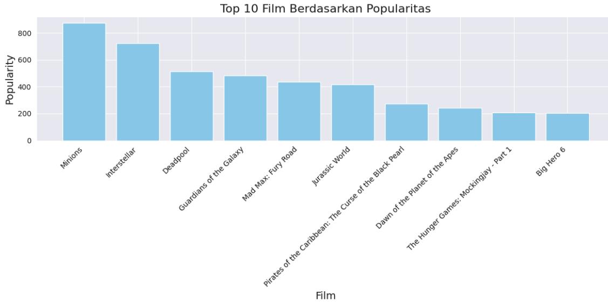

# Laporan Proyek Machine Learning - Muhammad Iqbal Pradipta

## Movie Recommendation System

Sistem Rekomendasi adalah alat penyaring informasi yang bertujuan untuk menyaring informasi yang relevan dari sejumlah besar data, terutama di era big data saat ini. Sistem Rekomendasi Film adalah alat berbasis pembelajaran mesin yang secara otomatis menyaring film dari basis data besar seperti Netflix, Amazon, dan lainnya berdasarkan preferensi pengguna [1], dan biasanya sistem rekomendasi [2, 3] dirancang untuk membantu manusia mengatasi masalah kelebihan informasi. Ketika kita perlu memilih di antara banyak pilihan yang belum kita miliki pengalaman sebelumnya (misalnya, film, buku, dan layanan), kita sering mengandalkan rekomendasi dari orang lain yang telah memiliki pengalaman tersebut. Saat ada banyak sekali pilihan, seperti di internet, menjadi tugas yang hampir mustahil untuk menemukan seseorang yang ahli yang dapat memberikan saran yang tepat untuk membuat pilihan yang sesuai.

Saat ini, platform seperti Netflix, Amazon Prime, dan Disney+ memiliki ribuan film yang tersedia, membuat pengguna menghadapi masalah information overload, di mana terlalu banyak pilihan membuat sulit bagi mereka untuk menemukan film yang sesuai dengan preferensi pribadi mereka.

Selain itu, preferensi pengguna sangat subjektif dan dinamis, sehingga menciptakan tantangan dalam menyediakan rekomendasi yang akurat dan relevan. Sistem rekomendasi film berbasis machine learning bertujuan untuk menyelesaikan masalah ini dengan menyaring dan mempersonalisasi konten berdasarkan data seperti riwayat tontonan, rating film, dan preferensi genre. Penelitian dalam bidang ini juga krusial karena kemampuan memberikan rekomendasi yang tepat akan meningkatkan kepuasan pengguna, memperpanjang waktu keterlibatan mereka pada platform, dan mendorong loyalitas pelanggan.

Dengan adanya rekomendasi yang lebih baik, tidak hanya pengguna yang diuntungkan, tetapi juga industri perfilman, karena film-film yang mungkin tidak mendapatkan eksposur besar dapat lebih mudah ditemukan dan dinikmati oleh penonton yang tepat. Hal ini menunjukkan bahwa penelitian dalam sistem rekomendasi film memainkan peran penting dalam menciptakan pengalaman yang dipersonalisasi, memperbaiki pengambilan keputusan, dan meningkatkan aksesibilitas terhadap beragam konten film.

## Business Understanding

Proyek ini berfokus pada pengembangan sistem rekomendasi film yang bertujuan untuk membantu pengguna menemukan film yang sesuai dengan preferensi mereka. Dengan banyaknya pilihan film yang tersedia di platform streaming seperti Netflix dan Amazon Prime, pengguna sering mengalami kesulitan dalam menentukan film mana yang ingin ditonton. Rekomendasi yang tepat dapat meningkatkan pengalaman pengguna, memperpanjang waktu keterlibatan mereka di platform, dan pada akhirnya meningkatkan pendapatan.

Bagian laporan ini mencakup:

### Problem Statements

Berdasarkan latar belakang di atas, berikut ini batasan masalah yang dapat diselesaikan dengan proyek ini:

- Bagaimana cara mengumpulkan dan mengolah data film, termasuk informasi tentang genre, sinopsis, dan aktor, untuk menciptakan sistem rekomendasi yang efektif?

- Metode apa yang dapat digunakan untuk membangun model rekomendasi film yang dapat menghasilkan rekomendasi yang relevan bagi pengguna?

### Goals

- Melakukan pengumpulan dan pemrosesan data dengan baik agar dapat digunakan dalam model rekomendasi.

- Mengimplementasikan algoritma rekomendasi untuk menghasilkan rekomendasi film.

- Mengetahui cara membuat model deep learning untuk rekomendasi film kepada user.


Pengembangan model rekomendasi akan dilakukan dengan menggunakan berbagai teknik, seperti TF-IDF untuk analisis teks dan algoritma SVD untuk menangani data sparse. SVD (Singular Value Decomposition) dipilih karena kemampuannya dalam mereduksi dimensi data dan meningkatkan kinerja rekomendasi dengan mempertimbangkan interaksi pengguna dan item secara lebih efektif.

Dengan menggunakan teknik ini, sistem rekomendasi yang dihasilkan diharapkan mampu memberikan rekomendasi yang lebih akurat dan relevan bagi pengguna, sehingga meningkatkan kepuasan dan loyalitas mereka terhadap platform film yang digunakan.


### Solution Statements

Solusi yang dapat dilakukan untuk mencapai tujuan sistem rekomendasi film adalah sebagai berikut:

- Mengimplementasikan model **Content-Based Filtering** menggunakan teknik **TF-IDF** untuk menganalisis teks deskripsi film dan informasi terkait, seperti genre, sutradara, dan aktor, guna menghasilkan rekomendasi yang sesuai dengan preferensi pengguna.
  
- Menggunakan algoritma **Singular Value Decomposition (SVD)** sebagai bagian dari **Collaborative Filtering** untuk memperhitungkan hubungan antara pengguna dan film berdasarkan riwayat rating yang tersedia, serta memprediksi rating film yang belum ditonton oleh pengguna.

- Mengukur performa model menggunakan metrik seperti **RMSE (Root Mean Squared Error)** dan **Precision-Recall**, serta membandingkan model untuk menemukan model yang memberikan akurasi prediksi tertinggi pada data uji.

## Data Understanding
Dataset yang digunakan dapat diakses menggunakan [Huggingface Dataset](https://huggingface.co/datasets/mhdiqbalpradipta/movie).

### Langkah-langkah pra-pemrosesan data
1. Menguhubungkan google drive ke google colab.
2. Membaca dataset menggunakan pandas
3. Menampilkan informasi dari dataset
4. Mengecek apakah terdapat missing value

### **1. Menghubungkan google drive ke google colab**

Pada proyek dataset yang sudah di download melalui huggingface, maka dataset akan disimpan ke dalam google drive. Dari google colab akan diakses dengan cara

```python
from google.colab import drive
drive.mount('/content/drive')
```

setelah di mount maka akan menentukan file path google drive yang akan diakses google colab

### **2. Membaca dataset menggunakan pandas**

```python
movies = '/content/drive/My Drive/ColabNotebooks/dicoding_ai/machine_learning_terapan/tmdb_movies.csv'
credits = '/content/drive/My Drive/ColabNotebooks/dicoding_ai/machine_learning_terapan/tmdb_credits.csv'
ratings_small = '/content/drive/My Drive/ColabNotebooks/dicoding_ai/machine_learning_terapan/ratings_small.csv'
```

Pada momen ini akan menggunakan fungsi read_csv() untuk membaca berkas dan menyesuaikan ke pandas Dataframe

```python
# Load the datasets
movies_df = pd.read_csv(movies)
credits_df = pd.read_csv(credits)
ratings_small_df = pd.read_csv(ratings_small)
```

Berikut tampilan movies_df dengan bentuk Dataframe di tabel 1.

Tabel 1. Tampilan sample movie dalam bentuk pandas Dataframe

| **Budget**  | **Genres**                                                                                                                   | **Homepage**                           | **ID**  | **Keywords**                                                                                            | **Original Language** | **Original Title**                 | **Overview**                                                                                     | **Popularity** | **Production Companies**                                                                                  | **Production Countries**                                                                         | **Release Date** | **Revenue**   | **Runtime** | **Spoken Languages**                                              | **Status**  | **Tagline**                               | **Title**                           | **Vote Average** | **Vote Count** |
|-------------|-------------------------------------------------------------------------------------------------------------------------------|----------------------------------------|---------|----------------------------------------------------------------------------------------------------------|-----------------------|------------------------------------|--------------------------------------------------------------------------------------------------|----------------|----------------------------------------------------------------------------------------------------------|------------------------------------------------------------------------------------------------|----------------|--------------|------------|------------------------------------------------------------------|------------|-------------------------------------------|------------------------------------|----------------|----------------|
| 237000000   | [{"id": 28, "name": "Action"}, {"id": 12, "name": "Adventure"}]                                                               | http://www.avatarmovie.com/            | 19995   | [{"id": 1463, "name": "culture clash"}, {"id": 1585, "name": "future"}]                                  | en                    | Avatar                              | In the 22nd century, a paraplegic Marine is dispatched to the moon Pandora.                        | 150.437577     | [{"name": "Ingenious Film Partners", "id": 289}]                                                         | [{"iso_3166_1": "US", "name": "United States of America"}]                                       | 2009-12-10     | 2787965087   | 162.0      | [{"iso_639_1": "en", "name": "English"}]                             | Released  | Enter the World of Pandora.                | Avatar                             | 7.2            | 11800          |
| 300000000   | [{"id": 12, "name": "Adventure"}, {"id": 14, "name": "Fantasy"}]                                                             | http://disney.go.com/disneypictures/pirates/ | 285     | [{"id": 270, "name": "ocean"}, {"id": 726, "name": "pirate"}]                                             | en                    | Pirates of the Caribbean: At World's End | Captain Barbossa, long believed to be dead, has come back to life.                                  | 139.082615     | [{"name": "Walt Disney Pictures", "id": 2}, {"name": "Jerry Bruckheimer Films", "id": 130}]             | [{"iso_3166_1": "US", "name": "United States of America"}]                                       | 2007-05-19     | 961000000    | 169.0      | [{"iso_639_1": "en", "name": "English"}]                             | Released  | At the end of the world, the adventure begins. | Pirates of the Caribbean: At World's End | 6.9            | 4500           |
| 245000000   | [{"id": 28, "name": "Action"}, {"id": 12, "name": "Adventure"}]                                                               | http://www.sonypictures.com/movies/spectre/ | 206647  | [{"id": 470, "name": "spy"}, {"id": 818, "name": "secret agent"}]                                        | en                    | Spectre                             | A cryptic message from Bond’s past sends him on a trail to uncover a sinister organization.        | 107.376788     | [{"name": "Columbia Pictures", "id": 5}, {"name": "Eon Productions", "id": 6}]                           | [{"iso_3166_1": "GB", "name": "United Kingdom"}]                                                | 2015-10-26     | 880674609    | 148.0      | [{"iso_639_1": "fr", "name": "French"}, {"iso_639_1": "en", "name": "English"}] | Released  | A Plan No One Escapes                      | Spectre                            | 6.3            | 4466           |
| 250000000   | [{"id": 28, "name": "Action"}, {"id": 80, "name": "Crime"}]                                                                  | http://www.thedarkknightrises.com/     | 49026   | [{"id": 849, "name": "dc comics"}, {"id": 853, "name": "crime fighter"}]                                 | en                    | The Dark Knight Rises               | Following the death of District Attorney Harvey Dent, Batman assumes responsibility for Dent's crimes to protect Gotham. | 112.312950     | [{"name": "Legendary Pictures", "id": 923}, {"name": "Syncopy", "id": 999}]                               | [{"iso_3166_1": "US", "name": "United States of America"}]                                       | 2012-07-16     | 1084939099   | 165.0      | [{"iso_639_1": "en", "name": "English"}]                             | Released  | The Legend Ends                            | The Dark Knight Rises              | 7.6            | 9106           |
| 260000000   | [{"id": 28, "name": "Action"}, {"id": 12, "name": "Adventure"}]                                                               | http://movies.disney.com/john-carter   | 49529   | [{"id": 818, "name": "based on novel"}, {"id": 772, "name": "mars"}]                                     | en                    | John Carter                         | John Carter, a war-weary former military captain, is inexplicably transported to the red planet Mars. | 43.926995      | [{"name": "Walt Disney Pictures", "id": 2}]                                                               | [{"iso_3166_1": "US", "name": "United States of America"}]                                       | 2012-03-07     | 284139100    | 132.0      | [{"iso_639_1": "en", "name": "English"}]                             | Released  | Lost in our world, found in another.       | John Carter                        | 6.1            | 2124           |


Berikut tampilan credits_df dengan bentuk Dataframe di tabel 2.

Tabel 2. Tampilan sample credits dalam bentuk pandas Dataframe

| **Movie ID** | **Title**                               | **Cast**                                                                                                                                 | **Crew**                                                                                                                             |
|--------------|-----------------------------------------|-----------------------------------------------------------------------------------------------------------------------------------------|-------------------------------------------------------------------------------------------------------------------------------------|
| 19995        | Avatar                                  | [{"cast_id": 242, "character": "Jake Sully", "actor": "Sam Worthington"}]                                                               | [{"credit_id": "52fe48009251416c750aca23", "department": "Directing", "job": "Director", "name": "James Cameron"}]                   |
| 285          | Pirates of the Caribbean: At World's End | [{"cast_id": 4, "character": "Captain Jack Sparrow", "actor": "Johnny Depp"}]                                                           | [{"credit_id": "52fe4232c3a36847f800b579", "department": "Directing", "job": "Director", "name": "Gore Verbinski"}]                  |
| 206647       | Spectre                                 | [{"cast_id": 1, "character": "James Bond", "actor": "Daniel Craig"}]                                                                    | [{"credit_id": "54805967c3a36829b5002c41", "department": "Directing", "job": "Director", "name": "Sam Mendes"}]                     |
| 49026        | The Dark Knight Rises                   | [{"cast_id": 2, "character": "Bruce Wayne / Batman", "actor": "Christian Bale"}]                                                        | [{"credit_id": "52fe4781c3a36847f81398c3", "department": "Directing", "job": "Director", "name": "Christopher Nolan"}]               |
| 49529        | John Carter                             | [{"cast_id": 5, "character": "John Carter", "actor": "Taylor Kitsch"}]                                                                  | [{"credit_id": "52fe479ac3a36847f813eaa3", "department": "Directing", "job": "Director", "name": "Andrew Stanton"}]                  |

Berikut tampilan ratings_df dengan bentuk Dataframe di tabel 3

Tabel 3. Tampilan sample ratings dalam bentuk pandas Dataframe

| **userId** | **movieId** | **rating** | **timestamp** |
|------------|-------------|------------|---------------|
| 1          | 31          | 2.5        | 1260759144    |
| 1          | 1029        | 3.0        | 1260759179    |
| 1          | 1061        | 3.0        | 1260759182    |
| 1          | 1129        | 2.0        | 1260759185    |
| 1          | 1172        | 4.0        | 1260759205    |

### **3. Menampilkan informasi dari dataset**

Dengan menggunakan .shape maka di dapat informasi seperti berikut

```python
rows, cols = movies_df.shape
print(f"Jumlah baris dataset movies: {rows}")
print(f"Jumlah kolom movies: {cols}")
```
Jumlah baris dataset movies: 4803
Jumlah kolom movies: 20

```python
rows, cols = credits_df.shape
print(f"Jumlah baris dataset credits: {rows}")
print(f"Jumlah kolom credits: {cols}")
```
Jumlah baris dataset credits: 4803
Jumlah kolom credits: 4

```python
rows, cols = ratings_small_df.shape
print(f"Jumlah baris dataset ratings_small: {rows}")
print(f"Jumlah kolom ratings_small: {cols}")
```

Jumlah baris dataset ratings_small: 100004
Jumlah kolom ratings_small: 4

kemudian cek untuk mengetahui info dari dataset dengan fungsi info() di tabel 2:


### Ringkasan Dataset Film

Dataset ini berisi 4803 data film dengan berbagai atribut, seperti anggaran, genre, dan popularitas. Berikut adalah deskripsi untuk setiap variabel/kolom dalam dataset:

Tabel 4: informasi dari dataset movies_df


| **Kolom**                | **Jumlah Non-Null** | **Tipe Data** | **Deskripsi** |
|--------------------------|---------------------|---------------|---------------|
| **budget**               | 4803 non-null       | int64         | Anggaran yang dialokasikan untuk pembuatan film dalam USD. |
| **genres**               | 4803 non-null       | object        | Daftar genre yang dimiliki film, disimpan sebagai string atau objek JSON. |
| **homepage**             | 1712 non-null       | object        | URL situs resmi atau homepage dari film tersebut. |
| **id**                   | 4803 non-null       | int64         | Identifikasi unik untuk setiap film. |
| **keywords**             | 4803 non-null       | object        | Kata kunci penting yang menggambarkan plot atau tema film, disimpan sebagai string atau objek JSON. |
| **original_language**    | 4803 non-null       | object        | Bahasa asli di mana film tersebut dirilis. |
| **original_title**       | 4803 non-null       | object        | Judul asli dari film tersebut. |
| **overview**             | 4800 non-null       | object        | Ringkasan atau sinopsis singkat dari plot film. |
| **popularity**           | 4803 non-null       | float64       | Skor popularitas berdasarkan berbagai faktor, seperti keterlibatan di media sosial dan tren pencarian. |
| **production_companies** | 4803 non-null       | object        | Perusahaan-perusahaan yang bertanggung jawab memproduksi film, disimpan sebagai string atau objek JSON. |
| **production_countries** | 4803 non-null       | object        | Negara tempat produksi film dilakukan, disimpan sebagai string atau objek JSON. |
| **release_date**         | 4802 non-null       | object        | Tanggal rilis film, biasanya dalam format YYYY-MM-DD. |
| **revenue**              | 4803 non-null       | int64         | Total pendapatan yang dihasilkan oleh film dalam USD. |
| **runtime**              | 4801 non-null       | float64       | Durasi film dalam menit. |
| **spoken_languages**     | 4803 non-null       | object        | Bahasa yang digunakan dalam film, disimpan sebagai string atau objek JSON. |
| **status**               | 4803 non-null       | object        | Status saat ini dari film tersebut (misalnya, Dirilis, Pasca-produksi). |
| **tagline**              | 3959 non-null       | object        | Slogan atau kalimat pendek yang menggambarkan film. |
| **title**                | 4803 non-null       | object        | Judul film. |
| **vote_average**         | 4803 non-null       | float64       | Rata-rata penilaian yang diberikan oleh penonton, dalam skala 1 hingga 10. |
| **vote_count**           | 4803 non-null       | int64         | Jumlah suara atau penilaian yang diterima oleh film tersebut. |

### Catatan:
- **Jumlah Non-Null:** Kolom ini menunjukkan berapa banyak data yang memiliki nilai valid (tidak kosong).
- **Tipe Data:** Kolom ini menunjukkan tipe data dari setiap variabel (misalnya, int64 untuk angka bulat, object untuk teks).

### Ringkasan Dataset Credits

Dataset ini berisi informasi mengenai pemain (cast) dan kru (crew) dari 4803 film. Setiap film diwakili oleh empat kolom utama, yaitu `movie_id`, `title`, `cast`, dan `crew`. Berikut adalah penjelasan dari setiap kolom:

Tabel 5: informasi dari dataset credits


| **Kolom**   | **Jumlah Non-Null** | **Tipe Data** | **Deskripsi** |
|-------------|---------------------|---------------|---------------|
| **movie_id**| 4803 non-null       | int64         | Identifikasi unik untuk setiap film, digunakan untuk menghubungkan dengan dataset film lainnya. |
| **title**   | 4803 non-null       | object        | Judul film yang sesuai dengan `movie_id`. |
| **cast**    | 4803 non-null       | object        | Daftar pemain utama dalam film, disimpan sebagai string atau objek JSON yang berisi informasi tentang peran aktor, nama aktor, dan `cast_id`. |
| **crew**    | 4803 non-null       | object        | Daftar kru yang terlibat dalam produksi film, disimpan sebagai string atau objek JSON. Termasuk informasi seperti direktur, penulis naskah, produser, dan posisi lainnya di dalam produksi. |

### Catatan:
- **movie_id:** Kolom ini bertindak sebagai kunci untuk menghubungkan dengan dataset lain, seperti dataset utama film.
- **cast:** Berisi informasi lengkap tentang aktor-aktor yang terlibat dalam film tersebut, sering kali dalam format JSON.
- **crew:** Berisi informasi tentang anggota kru yang bertanggung jawab atas pembuatan film, termasuk peran mereka dalam produksi.
- **title:** Merupakan judul asli dari film untuk memudahkan identifikasi film.

Dataset ini sangat berguna dalam analisis terkait peran aktor dan kru dalam film serta dapat digunakan untuk rekomendasi film berdasarkan pemain atau kru tertentu.

### Ringkasan Dataset Rating Film

Dataset ini berisi informasi tentang rating film yang diberikan oleh pengguna. Dataset terdiri dari empat kolom utama: `userId`, `movieId`, `rating`, dan `timestamp`. Berikut adalah penjelasan untuk masing-masing kolom:


Tabel 6: informasi dari dataset ratings

| **Kolom**    | **Jumlah Non-Null** | **Tipe Data** | **Deskripsi** |
|--------------|---------------------|---------------|---------------|
| **userId**   | 100004 non-null      | int64         | Identifikasi unik untuk setiap pengguna yang memberikan rating pada film. Setiap pengguna diwakili oleh ID yang unik. |
| **movieId**  | 100004 non-null      | int64         | Identifikasi unik untuk setiap film yang dinilai oleh pengguna. Kolom ini berhubungan dengan dataset film lainnya menggunakan ID film. |
| **rating**   | 100004 non-null      | float64       | Rating yang diberikan oleh pengguna untuk film tertentu. Rating ini berupa angka desimal, biasanya dalam rentang 0 hingga 5. |
| **timestamp**| 100004 non-null      | int64         | Stempel waktu (timestamp) yang merekam kapan pengguna memberikan rating tersebut. Tanggal ini dalam format Unix Timestamp. |

### Catatan:
- **userId:** Kolom ini digunakan untuk mengidentifikasi pengguna yang memberikan rating pada film. Setiap pengguna memiliki ID unik.
- **movieId:** Kolom ini digunakan untuk mengidentifikasi film yang diberi rating. Kolom ini dapat digunakan untuk menghubungkan dengan dataset film lainnya yang berisi informasi film.
- **rating:** Kolom ini berisi nilai rating yang diberikan oleh pengguna, yang biasanya dalam rentang 0 hingga 5.
- **timestamp:** Kolom ini merekam kapan rating tersebut diberikan dalam format Unix Timestamp, yang dapat diubah menjadi format tanggal yang lebih mudah dibaca manusia.

Dataset ini berguna untuk membangun sistem rekomendasi film, di mana rating yang diberikan oleh pengguna dapat digunakan untuk melatih model prediksi.

### Tahapan Memahami Data / EDA




Gambar 1: Historgram top 10 Film Berdasarkan Popularitas

#### Top 10 Film Berdasarkan Popularitas

Berikut adalah interpretasi dari visualisasi data yang ditampilkan pada gambar:

#### Visualisasi:
Grafik menunjukkan bahwa visualisasi ini menampilkan "Top 10 Film Berdasarkan Popularitas". Ini berarti film-film yang paling populer dalam dataset yang digunakan ditampilkan di sini, dengan film yang paling populer berada di sebelah kiri.

#### Sumbu Y (Popularitas):
Sumbu vertikal (y) mewakili skor popularitas dari setiap film. Popularitas ini mungkin didasarkan pada data penonton, pencarian, atau rating dari berbagai platform (tergantung sumber datanya). Nilai ini adalah variabel numerik.

#### Sumbu X (Nama Film):
Sumbu horizontal (x) mewakili judul film. Film-film tersebut diberi label dan ditempatkan dengan posisi miring untuk memudahkan pembacaan, karena ada banyak judul.

#### Film Paling Populer:
"Minions" menempati posisi pertama dengan popularitas tertinggi, diikuti oleh "Interstellar". Kedua film ini memiliki skor popularitas yang jauh lebih tinggi dibandingkan film lainnya.

#### Distribusi Popularitas:
Kita dapat melihat penurunan skor popularitas secara bertahap dari kiri ke kanan, dengan film-film seperti "Deadpool", "Guardians of the Galaxy", "Mad Max: Fury Road", dan "Jurassic World" berada di tengah-tengah dalam hal popularitas.

#### Film dengan Popularitas Lebih Rendah:
Di bagian paling kanan grafik, film seperti "Big Hero 6" memiliki skor popularitas yang relatif lebih rendah dibandingkan dengan film-film di sebelah kiri.

## Data Preparation

Di bagian ini, akan menjelaskan secara detail mengenai proses pembersihan data (data cleaning) dan preprocessing yang dilakukan untuk mempersiapkan dataset agar siap digunakan dalam analisis dan pemodelan. Proses ini sangat penting karena kualitas data yang baik akan berkontribusi langsung pada akurasi dan efektivitas model machine learning yang dibangun.

### Proses yang dilakukan

### a. Mengisi nilai yang null

```python
null_values_movies = movies_df.isnull().sum()
null_values_movies
```

Pada tabel berikut, kita dapat melihat jumlah missing values (nilai yang hilang) di setiap kolom dari dataset:

Tabel 7: Check fitur yang null


| Column                | Missing Values |
|-----------------------|----------------|
| budget                | 0              |
| genres                | 0              |
| homepage              | 3091           |
| id                    | 0              |
| keywords              | 0              |
| original_language     | 0              |
| original_title        | 0              |
| overview              | 3              |
| popularity            | 0              |
| production_companies  | 0              |
| production_countries  | 0              |
| release_date          | 1              |
| revenue               | 0              |
| runtime               | 2              |
| spoken_languages      | 0              |
| status                | 0              |
| tagline               | 844            |
| title                 | 0              |
| vote_average          | 0              |
| vote_count            | 0              |


1. **Homepage**: Kolom **homepage** memiliki 3091 nilai yang hilang. Ini mungkin disebabkan karena tidak semua film memiliki homepage atau website resmi. Nilai yang hilang dapat dibiarkan sebagai NaN karena tidak terlalu mempengaruhi proses rekomendasi.

2. **Overview**: Kolom **overview** memiliki 3 nilai yang hilang. Nilai ini penting untuk analisis berbasis konten, jadi entri dengan missing values ini dapat dihapus atau diisi dengan deskripsi singkat.

3. **Release Date**: Kolom **release_date** memiliki 1 nilai yang hilang. Nilai ini dapat diimputasi menggunakan tanggal rilis lain yang relevan jika mungkin, atau entri tersebut dapat dihapus.

4. **Runtime**: Kolom **runtime** memiliki 2 nilai yang hilang. Waktu tayang film adalah salah satu fitur penting dalam analisis film, jadi nilai yang hilang ini bisa diimputasi dengan nilai rata-rata atau median.

5. **Tagline**: Kolom **tagline** memiliki 844 nilai yang hilang. Karena tagline tidak selalu tersedia untuk setiap film, nilai yang hilang ini bisa dibiarkan atau diisi dengan string placeholder seperti "No Tagline Available".

**Mengisi nilai null fitur runtime dengan mean**

```python
runtime_mean = movies_df['runtime'].mean()
movies_df['runtime'] = movies_df['runtime'].fillna(runtime_mean)
```

**Mengisi nilai null fitur sisa dengan object kosong**

```python
movies_df['tagline'] = movies_df['tagline'].fillna(object())
movies_df['homepage'] = movies_df['homepage'].fillna(object())
movies_df['overview'] = movies_df['tagline'].fillna(object())
movies_df['release_date'] = movies_df['release_date'].fillna(object())
```

Untuk dataset credit dan rating tidak ada fitur yang bernilai null

### b. Menambah Kolom yang berupa json kedalam list 

Berikut fungsi untuk mengubah fitur menjadi fitur baru yang berupa list

```python
def extract_production_countries(countries):

def extract_production_companies(companies):

def extract_names(cast_json):

def convert_genres(json_str):

def extract_director(crew):
```

Tabel 8: Contoh tabel saat mengubah json menjadi list

| Title                                       | Production Companies Full                                                    |
|---------------------------------------------|------------------------------------------------------------------------------|
| Avatar                                      | Ingenious Film Partners, Twentieth Century Fox                               |
| Pirates of the Caribbean: At World's End    | Walt Disney Pictures, Jerry Bruckheimer Films                                |
| Spectre                                     | Columbia Pictures, Danjaq, B24                                               |
| The Dark Knight Rises                       | Legendary Pictures, Warner Bros., DC Entertainment                           |
| John Carter                                 | Walt Disney Pictures                                                         |
| Spider-Man 3                                | Columbia Pictures, Laura Ziskin Productions, Marvel Enterprises              |
| Tangled                                     | Walt Disney Pictures, Walt Disney Animation Studios                          |
| Avengers: Age of Ultron                     | Marvel Studios, Prime Focus, Revolution Sun Studios                          |
| Harry Potter and the Half-Blood Prince      | Warner Bros., Heyday Films                                                   |
| Batman v Superman: Dawn of Justice          | DC Comics, Atlas Entertainment, Warner Bros., Cruel and Unusual Films       |

### c.  Membersihkan Teks fitur overview (clean_text)

```python
# Fungsi untuk membersihkan teks
def clean_text(text):
    if isinstance(text, str):
        # Mengubah teks menjadi huruf kecil
        text = text.lower()
        # Menghapus angka dan karakter khusus
        text = re.sub(r'[^a-z\s]', '', text)
    return text

# Terapkan fungsi bersih pada kolom overview
movies_df['cleaned_overview'] = movies_df['overview'].apply(clean_text)

# Menghapus baris dengan cleaned_overview kosong
movies_df = movies_df[movies_df['cleaned_overview'].str.strip() != '']
```

Langkah-Langkah:
- Memeriksa Tipe Data: Fungsi pertama-tama memeriksa apakah input (text) adalah string. Ini penting untuk memastikan bahwa fungsi hanya memproses data yang valid dan menghindari kesalahan pada tipe data lainnya.
- Mengubah ke Huruf Kecil: Seluruh teks diubah menjadi huruf kecil. Ini membantu dalam menyamakan format dan menghindari masalah saat mencocokkan kata-kata (misalnya, "Film" dan "film" dianggap berbeda tanpa konversi ini).
- Menghapus Angka dan Karakter Khusus: Menggunakan regex (re.sub), semua karakter yang bukan huruf atau spasi dihapus. Ini membersihkan teks dari elemen yang tidak perlu, seperti angka, tanda baca, atau karakter khusus yang tidak relevan untuk analisis selanjutnya.

### d. Menggabungkan kedua dataset yaitu movies dengan credits dan ratings

```python
# Gabungkan credits_df dan movies_df berdasarkan movie_id dan id
merged_df = pd.merge(movies_df, credits_df[['movie_id', 'crew', 'cast_names']],
                     left_on='id', right_on='movie_id', how='left')

# Tampilkan kolom yang ada di merged_df untuk debugging
print("Kolom di merged_df:", merged_df.columns)

# Pilih kolom yang relevan dari merged_df
final_df = merged_df[['id', 'title', 'keywords', 'budget', 'genre_names',
                       'cleaned_overview', 'popularity',
                       'production_companies_full',
                       'production_countries_full', 'revenue',
                       'status', 'vote_average', 'vote_count',
                       'crew', 'cast_names']]

# Gabungkan hasil gabungan dengan ratings_df
final_df = pd.merge(ratings_small_df, final_df, left_on='movieId', right_on='id', how='left')

# Pilih kolom yang relevan dari final_df untuk SVD
final_df = final_df[['userId', 'movieId', 'rating', 'title', 'genre_names', 'cast_names']]
```


### e. Menghapus duplicate berdasarkan kolom 'title' 

```python
final_df = final_df.drop_duplicates(subset='title', keep='first').reset_index(drop=True)
```

## Modeling

Pada tahap ini, akan membangun sistem rekomendasi berdasarkan fitur overview.

## a. TF-IDF (Term Frequency-Inverse Document Frequency)

TF-IDF adalah ukuran statistik yang digunakan untuk mengevaluasi pentingnya suatu kata dalam dokumen relatif terhadap kumpulan dokumen. Teknik ini banyak digunakan dalam penambangan teks dan pemrosesan bahasa alami (NLP) untuk mengubah data teks menjadi vektor numerik, sehingga dapat digunakan oleh algoritma machine learning.

### Komponen TF-IDF

1. **Term Frequency (TF)**:
   - TF mengukur seberapa sering suatu istilah muncul dalam sebuah dokumen. Ini dihitung sebagai berikut:
   $$
   TF(t, d) = \frac{\text{Jumlah kemunculan kata } t \text{ dalam dokumen } d}{\text{Total kata dalam dokumen } d}
   $$
   - Nilai TF yang lebih tinggi menunjukkan bahwa istilah tersebut lebih signifikan dalam dokumen tersebut.

2. **Inverse Document Frequency (IDF)**:
   - IDF mengukur pentingnya suatu istilah di seluruh kumpulan dokumen. Ini dihitung sebagai berikut:
   $$
   IDF(t) = \log\left(\frac{\text{Total jumlah dokumen}}{\text{Jumlah dokumen yang mengandung kata } t}\right)
   $$
   - Kata-kata yang muncul sering di banyak dokumen dianggap kurang penting, sementara kata-kata yang muncul dalam lebih sedikit dokumen mendapatkan bobot yang lebih tinggi.

3. **TF-IDF**:
   - Nilai TF-IDF adalah hasil dari perkalian TF dan IDF:
   $$
   TF\text{-}IDF(t, d) = TF(t, d) \times IDF(t)
   $$
   - Istilah yang umum dalam dokumen tertentu tetapi jarang muncul di seluruh kumpulan dokumen akan memiliki skor TF-IDF yang tinggi, sehingga lebih berharga untuk memahami isi dokumen tersebut. Sebaliknya, kata-kata umum di semua dokumen akan memiliki skor yang lebih rendah.

Perumusan ini membantu mengidentifikasi kata-kata signifikan dalam sebuah dokumen, meningkatkan tugas analisis teks seperti pengambilan informasi, klasifikasi dokumen, dan pengelompokan.

Tabel 9: kata-kata yang sering muncul dari fitur cleaned_overview
|   Word   | Average TF-IDF |
|----------|----------------|
| love     | 0.018286       |
| life     | 0.014836       |
| story    | 0.012618       |
| time     | 0.011256       |
| world    | 0.011158       |
| man      | 0.010973       |
| just     | 0.009113       |
| hes      | 0.007696       |
| way      | 0.007256       |
| new      | 0.007132       |

### Interpretasi Data
- Kata "love" memiliki nilai TF-IDF tertinggi (0.018286), yang menunjukkan bahwa kata ini muncul secara signifikan dalam dokumen dan dianggap penting.

- Kata "life" dan "story" juga memiliki nilai TF-IDF yang relatif tinggi, yaitu 0.014836 dan 0.012618, yang menunjukkan bahwa kedua kata ini juga cukup penting dalam konteks dokumen tersebut.

- Sebaliknya, kata "new" memiliki nilai TF-IDF terendah di antara yang tercantum (0.007132). Ini menunjukkan bahwa kata ini mungkin lebih umum atau tidak memberikan makna yang signifikan dalam konteks yang lebih besar dari dokumen tersebut.


## b. Cosine Similarity

Cosine Similarity adalah metrik yang digunakan untuk mengukur kesamaan antara dua vektor dalam ruang vektor. Metrik ini banyak digunakan dalam pengolahan bahasa alami (NLP), pencarian informasi, dan pembelajaran mesin untuk mengukur seberapa mirip dua dokumen atau vektor fitur.

### Definisi

Cosine Similarity didefinisikan sebagai kosinus sudut antara dua vektor yang dinyatakan dalam rumus berikut:

$$
\text{Cosine Similarity} = \frac{A \cdot B}{||A|| \cdot ||B||}
$$

Di mana:
- \(A\) dan \(B\) adalah dua vektor.
- \(A \cdot B\) adalah hasil kali dot dari dua vektor.
- \(||A||\) adalah norma (panjang) dari vektor \(A\).
- \(||B||\) adalah norma (panjang) dari vektor \(B\).

### Interpretasi

- **Nilai 1**: Dua vektor identik dan sepenuhnya sejalan (sudut 0 derajat).
- **Nilai 0**: Dua vektor tidak memiliki kesamaan (sudut 90 derajat).
- **Nilai -1**: Dua vektor berlawanan arah (sudut 180 derajat).

### Penggunaan

Cosine Similarity sering digunakan dalam berbagai aplikasi, antara lain:

1. **Rekomendasi Konten**: Untuk menemukan konten atau item yang mirip berdasarkan fitur yang ada.
2. **Klasifikasi Teks**: Dalam klasifikasi dokumen untuk mengukur kesamaan antar dokumen.
3. **Pencarian Informasi**: Untuk menemukan dokumen yang paling relevan berdasarkan kueri pengguna.

### Keuntungan

- **Skala Tidak Berpengaruh**: Cosine Similarity tidak terpengaruh oleh magnitudo atau panjang vektor. Ini berarti dua dokumen yang panjangnya berbeda tetapi memiliki konten yang sama akan menghasilkan nilai kesamaan yang sama.
- **Mudah Dihitung**: Perhitungan menggunakan operasi linier yang sederhana dan efisien.

### Kekurangan

Kekurangan dari cosine similarity pada tabel di atas adalah sebagai berikut:

Tidak Mempertimbangkan Skala Fitur: Cosine similarity hanya memperhitungkan sudut antara dua vektor, bukan magnitude atau panjang vektornya. Ini berarti dua film yang sangat mirip tetapi memiliki skala berbeda (misalnya, satu film memiliki lebih banyak atribut atau detail) tetap bisa memiliki cosine similarity yang tinggi, meskipun jumlah informasi yang dimiliki bisa sangat berbeda.

Tabel 10: Cosine Similarity berdasarkan fitur cleaned_overview 

| No | Title           | Cosine Similarity |
|----|-----------------|-------------------|
| 1  | Taken 3         | 0.747440          |
| 2  | Veer-Zaara      | 0.549093          |
| 3  | Coyote Ugly     | 0.537654          |
| 4  | Hercules        | 0.524978          |
| 5  | Stoker          | 0.516975          |
| 6  | Dark City       | 0.491365          |
| 7  | The Black Hole  | 0.464159          |
| 8  | Pan             | 0.463130          |
| 9  | From Hell       | 0.443636          |
| 10 | Coach Carter    | 0.443218          |

Penjelasan tabel:

- Taken 3 memiliki nilai cosine similarity tertinggi (0.747440), artinya film ini sangat mirip dengan film referensi berdasarkan fitur yang dianalisis.
- Veer-Zaara dan Coyote Ugly juga memiliki kemiripan yang cukup tinggi, dengan nilai masing-masing 0.549093 dan 0.537654.
- Hercules dan Stoker mengikuti dengan nilai kemiripan di atas 0.5.
- Dark City dan The Black Hole memiliki kemiripan yang lebih rendah, sekitar 0.46-0.49.
- Pan, From Hell, dan Coach Carter memiliki nilai cosine similarity di bawah 0.46, yang berarti meskipun masih ada kemiripan, itu tidak sebesar film di posisi atas.

## c. Singular Value Decomposition (SVD)

### Pendahuluan

Singular Value Decomposition (SVD) adalah teknik matriks dekomposisi yang sering digunakan dalam bidang aljabar linear, machine learning, dan rekomendasi sistem. SVD adalah dekomposisi matriks yang memecah suatu matriks menjadi tiga matriks lain yang lebih sederhana untuk dianalisis. 

Dalam konteks sistem rekomendasi, SVD sering digunakan dalam model berbasis faktor untuk dekomposisi matriks pengguna-item, di mana pengguna dan item dimodelkan dalam bentuk faktor-faktor yang dapat membantu mengungkap pola laten antara pengguna dan item yang direkomendasikan.

### Rumus Matematika

Jika kita memiliki suatu matriks \( A \) dengan ukuran \( m \times n \), maka dekomposisi SVD adalah sebagai berikut:

$$
A = U \Sigma V^T
$$

Di mana:
- \( A \) adalah matriks asli \( m \times n \).
- \( U \) adalah matriks ortogonal \( m \times m \) yang terdiri dari *left singular vectors*.
- \( \Sigma \) adalah matriks diagonal \( m \times n \) yang berisi *singular values*.
- \( V^T \) adalah matriks ortogonal \( n \times n \) yang terdiri dari *right singular vectors*.

### Komponen-komponen:
- **Matriks \( U \)**: berisi *left singular vectors* yang menggambarkan hubungan antara baris-baris dalam matriks \( A \).
- **Matriks \( \Sigma \)**: diagonal dan berisi *singular values*, yaitu bobot yang menjelaskan seberapa penting setiap faktor laten.
- **Matriks \( V^T \)**: berisi *right singular vectors* yang menggambarkan hubungan antara kolom-kolom dalam matriks \( A \).

### Proses Dekomposisi

- Matriks \( U \) dan \( V \) adalah matriks ortogonal, yang berarti vektor-vektonya saling tegak lurus.
- Matriks \( \Sigma \) hanya berisi nilai-nilai singular pada diagonal utamanya, di mana nilai-nilai ini menentukan jumlah informasi yang dimiliki oleh setiap faktor laten.

### Penggunaan dalam Sistem Rekomendasi

SVD sering digunakan dalam **collaborative filtering** untuk membangun sistem rekomendasi berbasis matriks pengguna-item. Sistem ini bekerja dengan melakukan dekomposisi pada matriks interaksi pengguna dan item, lalu merekonstruksi matriks tersebut dengan menekan faktor laten yang tidak signifikan.

### Langkah-langkah:
1. **Input Matriks**: Matriks pengguna-item, di mana baris-barisnya adalah pengguna dan kolom-kolomnya adalah item yang dinilai.
2. **Dekomposisi SVD**: Matriks pengguna-item diuraikan menjadi tiga komponen: \( U \), \( \Sigma \), dan \( V^T \).
3. **Pembentukan Prediksi**: Setelah melakukan dekomposisi, kita dapat memprediksi rating pengguna terhadap item yang belum dinilai dengan merekonstruksi matriks dari faktor-faktor utama saja.
4. **Rekomendasi**: Sistem merekomendasikan item kepada pengguna berdasarkan prediksi nilai tertinggi dari matriks yang direkonstruksi.

```python
ratings_for_svd = final_df[['userId', 'movieId', 'rating']]
```

Data difilter untuk hanya mengambil kolom userId, movieId, dan rating.

### Gunakan Reader untuk Mengatur Skema Data

```python 
reader = Reader(rating_scale=(0.5, 5.0))
```
Reader digunakan untuk menentukan skema data, di mana rating berkisar dari 0.5 hingga 5.0.

### Konversi Data ke Format Surprise
```python
data = Dataset.load_from_df(ratings_for_svd, reader)
```

Data dikonversi ke format Surprise untuk digunakan oleh model SVD.

### Bagi Data ke dalam Train-Test Split

```python 
trainset, testset = train_test_split(data, test_size=0.25)
```
Data dibagi menjadi dua:
Train set (75%): Untuk melatih model.
Test set (25%): Untuk mengevaluasi model.
test_size=0.25 berarti 25% dari data akan menjadi test set.

### Inisialisasi Model SVD

```python
svd_model = SVD()
```
Algoritma SVD (Singular Value Decomposition) diinisialisasi. SVD membantu memprediksi rating yang hilang dengan menganalisis pola dalam data.

### Latih Model
```python
svd_model.fit(trainset)
```
Model dilatih menggunakan train set. Setelah pelatihan, model dapat digunakan untuk memprediksi rating yang belum diberikan oleh pengguna.

## Evaluasi

**Content-Based Filtering**

Pada tahap ini akan digunakan Precision untuk mengevaluasi hasil dari rekomendasi pada tabel 8. Precision dapat didefinisikan sebagai berikut:

$$ Precision = r / i $$

- r= total rekomendasi yang relevan

- i= jumlah rekomendasi yang diberikan

Untuk pendekatan content-based filtering, bisa dilihat untuk judul film The Dark Knight Rises merupakan film dengan genre [Action, Crime, Drama, Thriller] dari tabel bisa kita spesifikasikan yang masuk dalam kategori yang benar ada 7 sesuai dari kategori sedangkan film Pan, Dark City, Coyote Ugly tidak termasuk dari salah satu kategori. Artinya Precision sistem sebesar 7/10 atau 70%.

| Title          | Genre Names                                        |
|----------------|----------------------------------------------------|
| Taken 3        | [Thriller, Action]                                 |
| Veer-Zaara     | [Drama, Romance]                                   |
| Coyote Ugly    | [Comedy]                                           |
| Hercules       | [Action, Adventure]                                |
| Stoker         | [Drama, Horror, Thriller]                          |
| Dark City      | [Mystery, Science Fiction]                         |
| The Black Hole | [Adventure, Family, Science Fiction, Action]       |
| Pan            | [Adventure, Family, Fantasy]                       |
| From Hell      | [Horror, Mystery, Thriller]                        |
| Coach Carter   | [Drama]                                            |

**Collaborative Filtering**

### Evaluasi Model
```python
predictions = svd_model.test(testset)
accuracy.rmse(predictions)

RMSE: 0.9007
0.9007166193262276
```
Contoh hasil dengan user_id=3 menghasilkan film yang bisa menjadi recomendasi

```python
['Beetlejuice', 'Galaxy Quest', 'The Good Thief']
```

Nilai RMSE sebesar 0.9007 menunjukkan bahwa model rekomendasi yang digunakan cukup akurat, dengan kesalahan rata-rata prediksi yang relatif kecil. Metrik ini membantu untuk mengevaluasi dan membandingkan kinerja model, serta memberikan wawasan tentang bagaimana model dapat ditingkatkan di masa depan.

Referensi: 

[1] [Airena, S., & Agrawal, J. (2023). Movie Recommender System Using Parameter Tuning of User and Movie Neighbourhood via Co-Clustering. Procedia Computer Science, 218, 1176–1183.](https://www.sciencedirect.com/science/article/pii/S1877050923000960) 
[2] [Isinkaye F, Folajimi Y, Ojokoh B (2015) ”recommendation systems: Principles, methods and evaluation”. Egyptian Informatics Journal 16(3):261–273](https://www.sciencedirect.com/science/article/pii/S1110866515000341)
[3] [Park DH, Kim HK, Choi IY, Kim JK (2012) ”a literature review and classification of recommender systems research”. Expert systems with applications 39(11):10,059–10,072](https://www.sciencedirect.com/science/article/abs/pii/S0957417412002825)